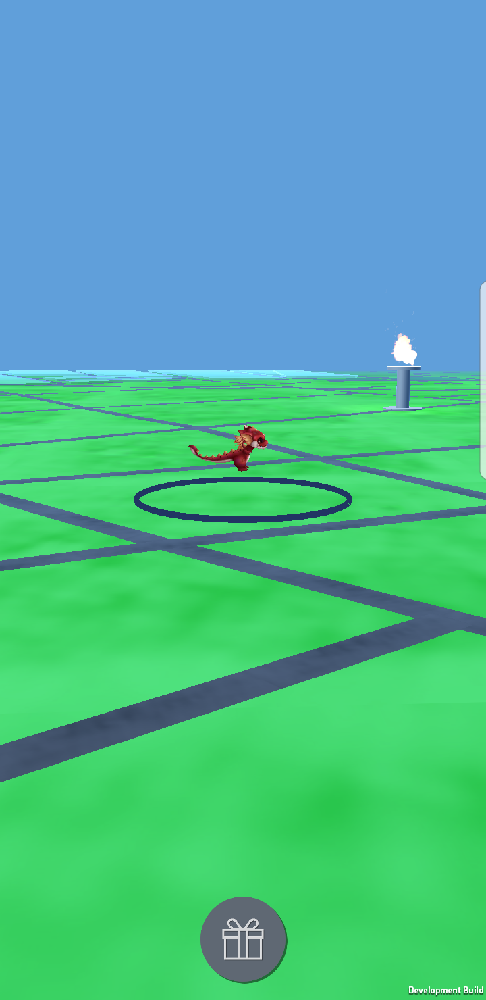

# Hunter

<p align="center">

</p>

## Description

Currently many companies opt for a reward system to promote their products. Hunter is an application that offers this type of service through an augmented reality application, making users compete with each other to obtain different prizes.
Hunter uses the NEM mosaics to represent the rewards that users can find in the application. Hunter has a main account and an associated namespace, to which companies can create different mosaics with a title, a description, a link to an image and a landmark identifier to represent the awards they wish to offer. On the other hand, users can use the application to see their position in the real world within a virtual world. When the user is close enough to a landmark and is the first to reach that position, they can claim the prize as their own and the token will be transferred to the account they indicated when they started the session.
When the user wishes to obtain the prize, they will simply indicate their email address within the application and return the mosaic token that was sent to them when the prize was obtained. In this way the company can contact him and deliver the prize. The account to which the token is returned will automatically transfer to a second administration account, to prevent users from being able to regain the prize from the main account.
The application has been developed with Unity, the world's leading game engine. Due to the fact that there is not a NEM library developed for the stable version of Unity and to protect the private keys of the administrator accounts, a server has been developed in NodeJS to make the transfers between the different accounts. The NEM API has been used to obtain the mosaics and the account status of the players.
Mapbox SDK was used to generate the maps, which enabled us to define the points where companies can put a landmark and modify the aesthetics of the maps displayed by the user to improve the experience of use.


## Website

More info in hunterapp.io

## Short video featuring the working application

[](https://www.youtube.com/watch?v=ByZ5MtOoYUs)

## Test the application
1. Download Android apk from this [link](http://hunterapp.io/assets/android.apk)
2. Join into the [Telegram group](https://t.me/hunter_beta) and request some fake prizes in your area.

## Snapshots

<table>
<tr>
    <td>
        
    </td>
    <td>
        
    </td>
    <td>
          
    </td>
</tr>
<tr>
    <td>
        
    </td>
    <td>
        
    </td>
    <td>
          
    </td>
</tr>
<tr>
    <td>
        
    </td>
    <td>
        
    </td>
    <td>
          
    </td>
</tr>
</table>

# Installation

## Unity

Download the repository [Hunter_Unity](https://github.com/pautena/Hunter_Unity/tree/43fa45bbbd1cfa2a3619af8a25a2ab2c9eea9f12)

```
git clone https://github.com/pautena/Hunter_Unity.git
```

Open the project with [Unity 2017.3](https://store.unity.com/?_ga=2.87247704.1561599505.1517345987-309819701.1514242339).

Click [here](docs/UNITY.md) to show more info about how to edit and configure the map in Unity


## Backend

Download the repository [Hunter_Backend](https://github.com/pautena/Hunter_backend/tree/ea036965b10d5c5dc24929b3b181e0d76295cc0f)

````
git clone https://github.com/pautena/Hunter_backend.git
````

Install all dependencies:
````
npm install
````

And start the server:

````
node app.js
````

Click [here](docs/BACKEND_NODEJS.md) to show more info about the estructure of the backend.

## Mapzen configuration
In progress...


# How to contribute
Check [CONTRIBUTING.md](docs/CONTRIBUTING.md)

# Licence
[MIT Licence](docs/LICENCE.md)


